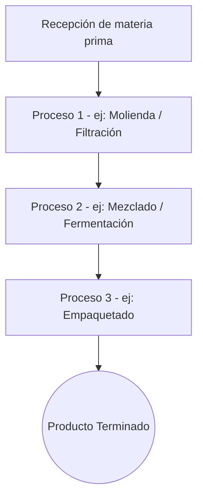

# [Título del Proyecto]

> **Nota:** (Reemplazar con el título elegido de los 3 candidatos propuestos en la Fase 1)

## Información del Proyecto
- **Curso:** Automatización y Control de Procesos
- **Programa:** Ingeniería de Sistemas y Computación
- **Duración:** 2 meses (8 semanas)
- **Modalidad:** Trabajo en parejas
- **Producto final:** Borrador artículo científico + Prototipo SW/HW + Sustentación oral (EAiFi)

---

## 1. Identificación del Problema y Justificación
- **Problema:** [Párrafo describiendo el problema técnico a resolver]
- **Justificación:** [Párrafo de justificación del proyecto]
- **Títulos Candidatos:**
  1. [Título 1]
  2. [Título 2]
  3. [Título 3]

## 2. Introducción
*(Redactar 3 párrafos al final del proyecto)*
1. **Concepto general:** [Descripción del contexto]
2. **Motivación:** [Conceptos encontrados en el trabajo para motivar al lector]
3. **Cierre con Objetivo:** [Conclusión de la introducción con el objetivo y la importancia de implementar/identificar el sistema]

## 3. Objetivos
### Objetivo General
[Definir el objetivo general del proyecto articulando el problema, metodología y prototipo]

### Objetivos Específicos
1. [Objetivo Específico 1]
2. [Objetivo Específico 2]
3. [Objetivo Específico 3]
4. [Objetivo Específico 4]

## 4. Marco Teórico

### 4.1 Definiciones (40)
[Definiciones básicas del producto a desarrollar, historia, proceso general]

### 4.2 Descripción de la Planta
[Describir la planta y su entorno]

### 4.3 Especificar el proceso a automatizar
- **Materias Primas (agronet):** [Describir una a una las materias primas macro y micro requeridas]
- **Capacidad de la Planta:** [Capacidad de producción anual, cálculos de producción por hora, cantidad de operarios, turnos y % de pérdida de producto o fallos]

### 4.4 Diagrama de Proceso
*(Ejemplo base, modificar según el proceso específico a automatizar)*

### 4.5 Descripción del Proceso (Variables a Controlar)
[Descripción detallada de cada subproceso del diagrama, identificando claramente las variables específicas a controlar (Ej: Temperatura, Tiempo, pH, Viscosidad) para la posterior búsqueda de sensores y actuadores.]

### 4.6 Maquinaria Requerida
| Nombre | Link al PDF (Datasheet) | Imagen | Marca | Fabricante | Qué hace | Cómo lo hace | Por qué se hace | Detalles Técnicos |
|---|---|---|---|---|---|---|---|---|
| [Nombre] | [Link] | **[PANTALLAZO: Fotografía o esquema de la máquina]** | [Marca] | [Fabricante] | [Descripción] | [Funcionamiento] | [Razón] | [Detalles] |

### 4.7 Instrumentación
#### a) Sensores
| Nombre | Link al PDF (Datasheet) | Imagen | Característica 1 | Característica 2 | Característica 3 |
|---|---|---|---|---|---|
| [Nombre Sensor] | [Link] | **[PANTALLAZO: Fotografía del sensor (ej. sacada del datasheet)]** | [Rango/Medida] | [Resolución/Error] | [Dimensiones/Voltaje] |

#### b) Controladores
[Especificar el Controlador/PLC elegido]

#### c) Actuadores
[Especificar actuadores seleccionados: válvulas, motores, resistencias, etc.]

### 4.8 Plano de Planta
**[PANTALLAZO: Captura del plano de planta en 2D (ej. AutoCAD) con su respectiva nomenclatura y distribución de equipos]**

### 4.9 Actualidad de Automatización para el Alimento
[Estado del arte y tecnologías actuales usadas en la industria para este producto]

### 4.10 PESTLE
[Análisis Político, Económico, Sociocultural, Tecnológico, Legal, Ecológico]

---

## 5. Metodología Experimental y Desarrollo

### 5.1 Plan Metodológico
[Describir paso a paso la metodología para llevar a cabo el proyecto]

### 5.2 Recursos Requeridos
- **Hardware (HW):** [Componentes electrónicos, tarjetas, sensores, etc.]
- **Software (SW):** [Entornos de desarrollo, simuladores, lenguajes de programación]

### 5.3 Diseño del Prototipo y Protocolo Experimental
- **Diagrama del Prototipo:** 
  **[PANTALLAZO: Esquema lógico, eléctrico o de arquitectura de software/hardware del prototipo]**
- **Lista de Materiales:** [Inventario de elementos para la construcción]
- **Protocolo de Pruebas:** [Guía de cómo se ejecutarán las validaciones y pruebas sobre el prototipo]

### 5.4 Ejecución de Pruebas y Recolección de Datos
[Registros experimentales, tablas de toma de datos y resultados del Sprint 1 y pruebas finales]

---

## 6. Resultados y Análisis
*(Sección base para el borrador del artículo científico)*
- **Métodos y Resultados:** [Análisis de los datos recolectados durante las pruebas]

## 7. Integración Final y Conclusiones
- **Video Demo:** **[PANTALLAZO O ENLACE: Miniatura o enlace al video demostrativo del prototipo funcionando]**
- **Conclusiones:** [Redactadas en base a los objetivos y resultados]
- **Agradecimientos:** [Reconocimientos]

## 8. Referencias
[Listado de bibliografía (recordar usar sangría francesa según APA 7, aunque en este formato Markdown se puede listar con viñetas o numeración simple)]
